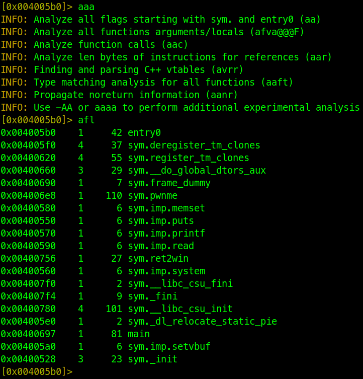
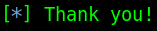
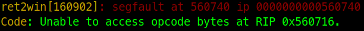
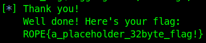

# ret2win

Executing `checksec` on the binary results that there’s no [PIE](https://en.wikipedia.org/wiki/Position-independent_code), such makes overriding the stack not a pain in the buttocks.

Now the only thing left is to find the offset of the function that’ll give the flag and feed it to the binary. Doing so will result into offset `756`. Anything will do, but in this case I’m more used with radare2.


Using the basic template of pwntools we only need to send the 40bytes of junk, for x86_64 arch, and the bytes of the address at which RIP should point at.

```python
junk = cyclic(40)
rip = bytes.fromhex('400756')

io.sendafter(b'> ', junk + rip)
log.info(io.recvall().decode())
```

It returns only “Thank you!”, but a flag was also expected. Now, did [RIP](https://en.wikipedia.org/wiki/Program_counter) actually get overwrite with the good address?



Since this is the first challenge on the page, they left some commands to check the segmentation faults on the machine. 



That’s unfortunate. RIP did get overwrite, but the address seems reversed.

The reversion of the expected RIP happens due to endianness, the binary’s using little endian so the addresses of the functions are actually reversed as well.

Thankfully cyberchef can already do that for us with the operation `Swap endianness`, deselect *Pad incomplete words* option.

Doing so will return address `560740` which if replaced with the previous will return the flag.



Alternatively, instead of setting directly setting the address of the function pwntools could’ve figure it out automatically.

```python
elf = ELF(exe, checksec=False)
rip = elf.symbols.ret2win.to_bytes(4, 'little')
```
